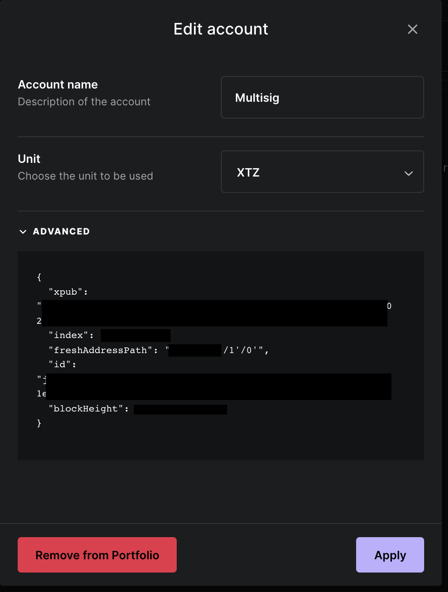
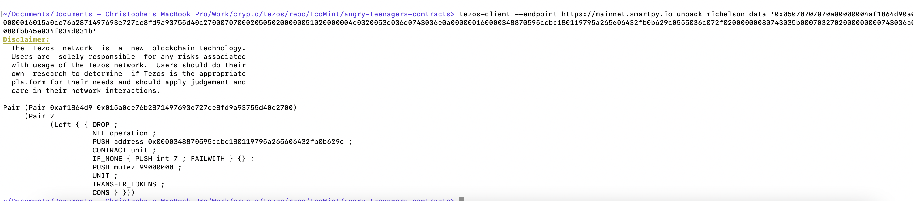
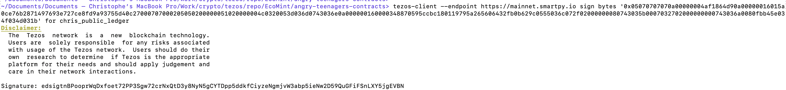

# How To Interact with the Multisig

# Requirements

Multisig members will need to:

- Use an hardware wallet. This document will describe how to use a [Ledger Nano](https://www.notion.so/Testing-the-Minting-Experience-Workflow-WIP-fc764f92c5104cbf9948ea3e951c265a).
- Provide their public key to the contract administrator. This key will be injected into the multisig contract.
- Check and sign transactions provided by the contract administrator. This document describes how to interact with the multisig using a terminal with a `tezos-client` installed

## Installation

This document describes the process specific to MacOS. Other operating systems are supported, and instructions can be found via the [official Tezos documentation](https://tezos.gitlab.io/introduction/howtouse.html).

## Prerequisites

### Ledger

Install the Tezos application on your Ledger using [Ledger Live](https://www.ledger.com/ledger-live).

<aside>
🚧  Before beginning is advised to create a new Tezos account in the Ledger specifically for this multisig. This can be done with the [Ledger Live software](https://www.notion.so/Testing-the-Minting-Experience-Workflow-WIP-fc764f92c5104cbf9948ea3e951c265a).

</aside>

### Install brew

[Brew](https://www.notion.so/Testing-the-Minting-Experience-Workflow-WIP-fc764f92c5104cbf9948ea3e951c265a) is a packet manager needed to install the `tezos-client` on MacOS.

To install Brew, follow the instructions on [the official website](https://www.notion.so/Testing-the-Minting-Experience-Workflow-WIP-fc764f92c5104cbf9948ea3e951c265a) or simply enter the following command in a terminal:

```bash
/bin/bash -c "$(curl -fsSL [https://raw.githubusercontent.com/Homebrew/install/HEAD/install.sh](https://raw.githubusercontent.com/Homebrew/install/HEAD/install.sh))"
```

### Install the tezos-client

For simplicity we’re leverage existing documentation on the [TQTezos site](https://www.notion.so/Testing-the-Minting-Experience-Workflow-WIP-fc764f92c5104cbf9948ea3e951c265a), which also includes instructions for Linux and Windows installations. The instructions leverage a packaged version of the `tezos-client` provided by [Serokell](https://www.notion.so/Testing-the-Minting-Experience-Workflow-WIP-fc764f92c5104cbf9948ea3e951c265a).

In a terminal, type:

```bash
brew tap serokell/tezos-packaging-stable https://github.com/serokell/tezos-packaging-stable.git
```

Then:

```bash
brew install tezos-client
```

## How to get your public key

First you must know your public key hash (PKH). This is usually the address that every Tezos user knows, and corresponds to a `tz..` prefixed account reference. If you are connected to a wallet like [Temple](https://www.notion.so/Testing-the-Minting-Experience-Workflow-WIP-fc764f92c5104cbf9948ea3e951c265a), you can find it visible in their UI:


To proceed we’ll need to find your address with the `tezos-client` you’ve installed. The address is dependent on the derivation path you used to create the account. The default Tezos account has a derivation path ending in `0h/0h`. If you create a second Tezos account it is likely your derivation path will end in `1h/0h`.

You can use Ledger Live to find your derivation path. First connect your ledger to your computer, enter the pin code and open the Tezos application on the device.

Next, in the “accounts” section of Ledger Live click on the account you intend to use for the multisig. 

Click on the wrench icon in the top right, once the account is selected.


Clicking the arrow to the left of “Advanced” you’ll see a piece of JSON data. Under the key “freshAddressPath”, note the last two pieces of the derivation path. In the example below, you’ll notice it ends in `/1'/0'`.



Now, enter the following command in a terminal to find your Ledger identifier:

```bash
tezos-client list connected ledgers
```

This will give you a bunch of information. Search for something in this form:

```bash
# ... ledger://WORD1-WORD2-WORD3-WORD4/bip25519/0h/0h
```

These four words are the identifier of you ledger. You’ll notice a number of key derivations. The first one (bip25519) is sufficient.

Taking the last two numbers you found in Ledger Live above, adjust the derivation path in the following command. For example if your derivation path in Ledger Live ended in `/1'/0'` adjust the Ledger path to `ledger://WORD1-WORD2-WORD3-WORD4/bip25519/1h/0h`.

Enter the following command, replacing the four words with your own:

```bash
tezos-client show ledger "ledger://WORD1-WORD2-WORD3-WORD4/bip25519/1h/0h”
```

This will return a *public key* and a *public key hash*. If you added this account to Temple, you’ll be able to verify the given PKH matches the one in Temple. Note this, as you’ll need to prove it to the Multisig administrator. 

If this command failed, it’s likely there is an issue with your derivation path. Verify in the Ledger app your derivation path. If still no luck, you may have to use a different signing curve too. You can try to replace `bip25519` with `ed25519` or `secp256k1` or `P-256`.

## Import your public key to your tezos-client

<aside>
⚠️ Your Ledger must be connected with the pin entered and the Tezos application open.

</aside>

Now, you need to import your *public key* to your tezos-client. This is a safe operation that will copy only the *public key*. The private key will remain protected in the Ledger, which you’ll need to authorize *all* signing operations with.

Using the same derivation path that you used in the previous step to find your public key (something like `"ledger://WORD1-WORD2-WORD3-WORD4/ed25519/0h/0h`) enter the following command, replacing the <derivation_path> with your `ledger://...` value, and replacing <name> with a nickname of your choice (e.g. ledger-multisig).

```bash
tezos-client import secret key <name> <derivation_path>
# tezos-client import secret key ledger-multisig ledger://WORD1-WORD2-WORD3-WORD4/ed25519/0h/0h
```

After entering the command, you need to accept the transaction on the Ledger itself. After importing, you’ll be able to verify the account has been imported with the following command:

```bash
tezos-client list known addresses
```

If successful, you’ll be able to see something like the following:

```bash
ledger-multisig: tz1.... (ledger sk known)
```

## Signing a Transaction

The multisig admin will provide transaction in a form of an array of bytes (a piece of text of characters and numbers). This array represents an operation on the multisig, such as transferring funds to another account.

You need to sign the transaction and return the hash to the multisig admin for submission to the blockchain.

It is strongly advised to decode the array of bytes and verify the transaction before signing it. The decoding will return some [Michelson code](https://www.notion.so/Testing-the-Minting-Experience-Workflow-WIP-fc764f92c5104cbf9948ea3e951c265a) so you will have to learn a little bit how to read it.

### Decode

Type in the terminal:

```bash
tezos-client --endpoint https://mainnet.smartpy.io unpack michelson data <array_of_bytes>
```

With `<array_of_bytes>` been the data provided by the multisig admin. Check the resulting Michelson to be sure you understand what you sign.

**Example:**



This Michelson code means that 99000000 mutez will be pushed to address `0x0000348870595ccbc180119795a265606432fb0b629c`.

To decode `0x0000348870595ccbc180119795a265606432fb0b629c` to a readable address you can use the [following python script](https://www.notion.so/W-E-19th-August-weekly-updates-81975f2acfe142a09ea92f955eea4bb7): 

```python
from hashlib import blake2b, sha256
from base58 import b58encode

pubkey = b'0x0000348870595ccbc180119795a265606432fb0b629c'
P2HASH_MAGIC = bytes.fromhex('06a1a4')
blake2bhash = blake2b(pubkey, digest_size=20).digest()
shabytes = sha256(sha256(P2HASH_MAGIC + blake2bhash).digest()).digest()[:4]
pkhash = b58encode(P2HASH_MAGIC + blake2bhash + shabytes).decode()
print(pkhash)

# prints out tz3bkMe2gTftBP6bh6HKSdfazSTPUc12j7x4
```

### Sign

Now that you know what the array of bytes represents, you can proceed with sign the transaction. Signing the transaction does not submit any action to the blockchain, it is an operation confined to your device. 

Type in the terminal:

```bash
tezos-client --endpoint [https://mainnet.smartpy.io](https://mainnet.smartpy.io/) sign bytes <array_of_bytes> for <name>
```

With `<array_of_bytes>` been the data provided by the multisig admin and <name> been the name you choose when you imported your wallet from your Ledger.

After entering the command you will have to accept the transaction info on the Ledger itself.

Example:



Return the signature to the multisig admin, who will collect signed operations from a quorum of multisig members and proceed to submit the signatures to the multisig contract on the blockchain itself.